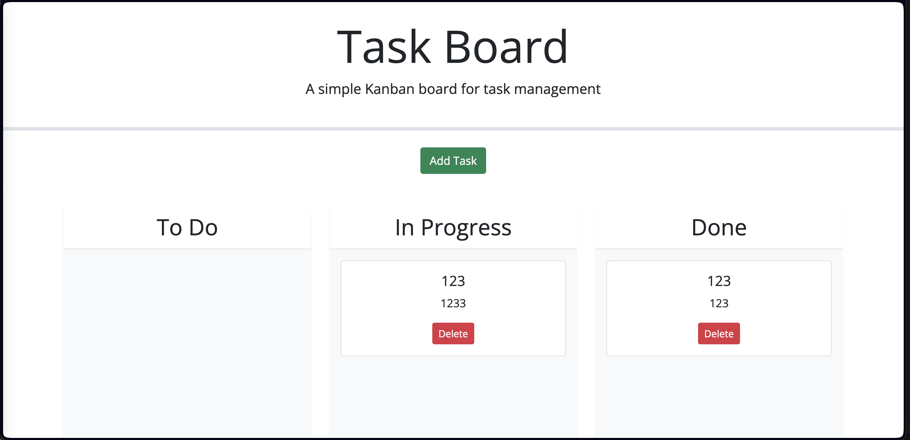

# SEO-Employee-Taskboard

In this project, we created a simple Taskboard to keep employees' tasks orderly, as well as give them an easy way to finish and move their tasks.

# User Story

AS A project team member with multiple tasks to organize  
I WANT a task board  
SO THAT I can add individual project tasks, manage their state of progress and track overall project progress accordingly  

# Acceptance Criteria

GIVEN a task board to manage a project  
WHEN I open the task board  
THEN the list of project tasks is displayed in columns representing the task progress state (Not Yet Started, In Progress, Completed)  
WHEN I view the task board for the project  
THEN each task is color coded to indicate whether it is nearing the deadline (yellow) or is overdue (red)  
WHEN I click on the button to define a new task  
THEN I can enter the title, description and deadline date for the new task into a modal dialog  
WHEN I click the save button for that task   
THEN the properties for that task are saved in localStorage   
WHEN I drag a task to a different progress column  
THEN the task's progress state is updated accordingly and will stay in the new column after refreshing  
WHEN I click the delete button for a task  
THEN the task is removed from the task board and will not be added back after refreshing  
WHEN I refresh the page  
THEN the saved tasks persist  

# Site 

[Site link](https://authorixed.github.io/SEO-Employee-Taskboard/)

# Credits

[Draggable Element](https://www.w3schools.com/howto/howto_js_draggable.asp)  
[LocalStorage JS](https://developer.mozilla.org/en-US/docs/Web/API/Window/localStorage)